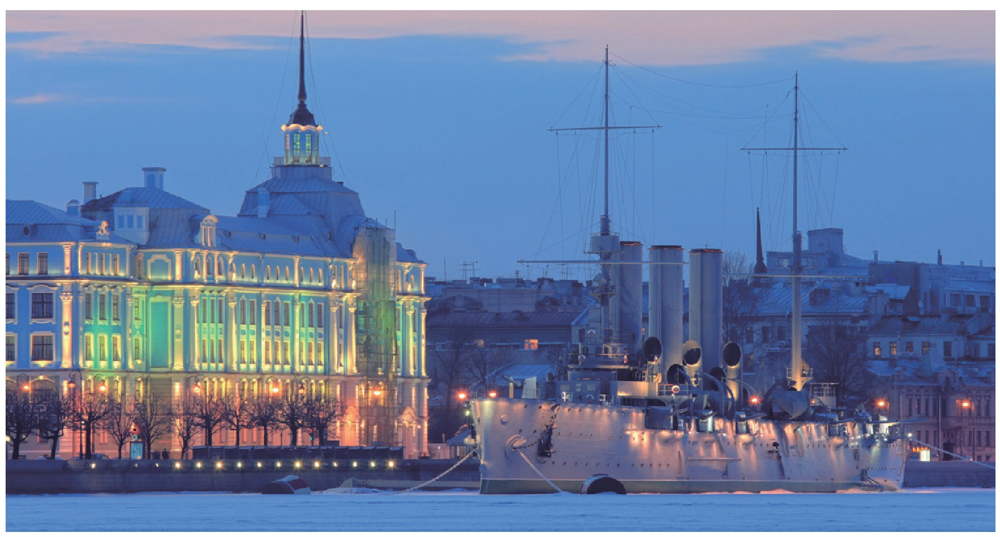
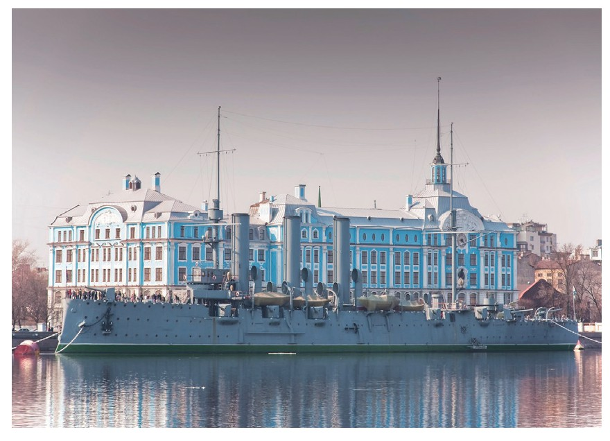
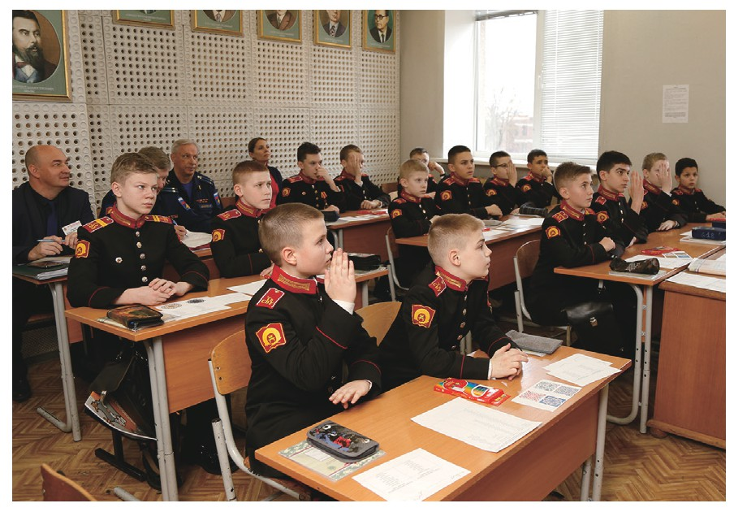
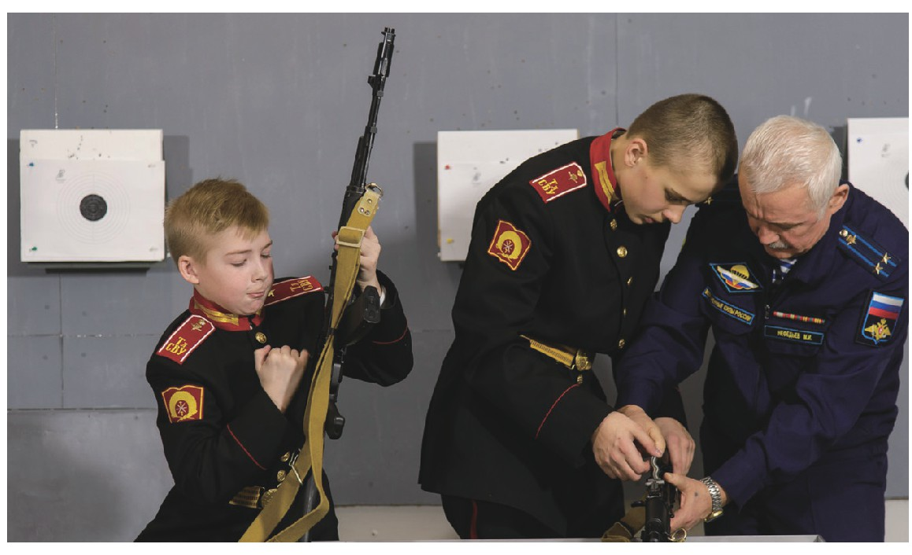
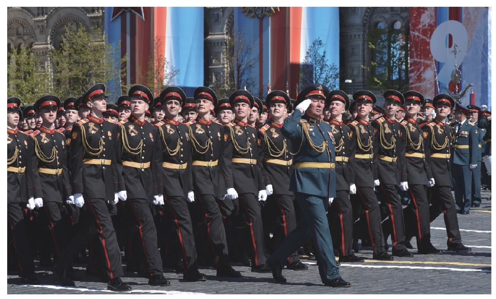

# [转载]少年军校——俄罗斯强大国防的基础工程

## 写在前面

> 该文章转载自2021年1月份的《军事文摘》，作者是安子谦。
>
> 转载该文章的原因是我认为这篇文章介绍的内容对于中国有一定的参考意义。

--------------

## 正文

-----------------------------

​		俄罗斯少年军校是俄军院校体系的重要组成部分，具有悠久的发展历史，是建设强大国防的基础工程。少年军校属于中学教育，学校的基础设施好，师资力量强，教学质量高。除了向部队输送高素质人才外，少年军校还承担着弘扬爱国主义精神，凝聚民心、提振士气，为国家培养可靠的接班人的重任

#### 跨越百年的发展历程

​		俄罗斯少年军校的历史可以追溯到200多年前的武备中学。武备中学是一种享受特权的中等军事寄宿学校，最初出现于17世纪下半叶的普鲁士，为培养贵族子弟担任军职而建立。学校招收年龄在13到18岁的贵族子弟。毕业后，表现优秀者被分配到军队，其他的被派往民事岗位。19世纪60年代，武备中学开始招收非贵族出身的子弟，毕业生有进入军事院校学习的优先权。到1917年，俄国共有31所武备学校，武备生总数达万余人。十月革命后由于帝俄军队被取缔，武备中学也因此关闭。

​		而现代的俄罗斯少年军校，大多诞生于卫国战争的战火硝烟中。1943年8月21日，苏联党和政府发布命令，要求苏联各地开始建立少年学校，按照之前俄国武备中学的模式创办，在为孩子们提供普通中学教育的同时，也是他们做好了在军队高等院校继续深造的准备。随即建立了苏沃洛夫军事学校。1943年10月16日又创建了纳希莫夫海军军事学校。战时困难之际，国家为少年军校提供全力支持。少年军校最初的办学目的是为了安置、教育和培养在卫国战争中牺牲烈士的遗孤。战后，少年军校逐渐变成了为苏军培养后备力量的中学。

​		苏联解体后，俄罗斯继承了少年军校的办学模式，并将其发展壮大，不仅恢复了武备中学，而且还创办了具有不同特色的少年军校。比如只招收女生的国防部寄宿学校，俄总统亲自倡议建立的总统武备中学以及培养人才的军事通信学院IT技术武备中学、军事体育专科学院体育武备中学和空军学院军事教学研究中心工程武备中学。

​		目前，俄罗斯的国防部、内务部、联邦安全局、紧急情况部、科学与高等教育部都有属于自己的“少年军校”，而且俄罗斯的普通中学内也设有大量的“少年军校班”。仅国防部就有隶属于自己的27所少年军校，其中包括11所苏沃洛夫军事学校；纳西莫夫（注：原文如此，和上文译名有差异）海军军事学校（有3所分校——符拉迪沃斯托克分校、塞瓦斯托波尔分校和摩尔曼斯克分校）；9所武备中学；7所总统武备中学。这27所少年军校均已被正式纳入俄军院校体系之中。

#### 别具一格的教育体制

​		俄罗斯的少年军校一般学制为7年（个别学校为2年或3年10月），教育过程分两个阶段进行——普通基础教育（初中、5年）和中等基础教育（高中、2年）。采用全日制教学形式。学员的全部费用由国家供给。

###### “百舸争流的入学考试”

​		少年军校招收小学四年级毕业生（有些学校招收6岁或15岁的特长生），但是想进入少年军校的大门并不容易。孩子入学前，需要通过严格的考试，大约5~6人竞争一个名额，甚至是10人去“抢”一个名额，而且参加考试的孩子，必须要获得原学校的良好评价。考试科目有俄语、数学和外语。如果考试成绩相同，那么军人家庭的孩子就会被优先录取。烈士子女或者孤儿只要通过体检则可以直接入学。

###### “令行禁止”的管理模式

​		入学之后，学员要接受严格的军事化管理，一切按照条令来进行。为了让孩子们能尽快适应军校生活，学校会清心理专家对学员进行“断奶”式教育，帮助他们实现由孩子到学员的转变。同时，学员自入校第一天开始，就有人教他们如何规范着装，如何整理内务，如何缝补、熨烫衣服。新学员一旦穿上配有肩章和帽徽的制服，言行举止上的孩子气顿时便消失大半。严整的仪容、规范的着装、得体的举止，可以培养严谨的军人作风、提升荣誉感和自信心。

###### “文武兼修”的教学理念

​		少年军校90%的课程与地方普通中学相同，毕竟传授丰富的科学文化比过早的向学生灌输纯军事教育，更有利于培养高素质军人。因此，**西方媒体称俄少年军校充斥着“沙文主义教育”的提法是有失偏颇的**。学校开设俄语、数学、英语和信息学等文化课程。学员还可以再选修一门外语，比如德语和法语。少年军校教师的整体水平明显高于普通中学，有的教师甚至拥有教授职称。除了要完成普通中学的教育教学任务外，学校还要开设军事课程，使学员学到必要的军事知识和技能，如如列队训练、射击、汽车驾驶、近身格斗等。令人震撼的是，这些“娃娃兵”也会像军人一样，在冰天雪地里进行拉练。此外学员在假期里可以选择前往俄军部队体验生活，这样可以使他们“零距离”接触军营，为日后在部队服役积累宝贵经验。

​		少年军校遵循开放式培养原则，注重学员综合素质的提升。学校特别重视体能训练，每位学员起码要有一门体育强项，很多人有两项甚至三项。他们之中有不少人是一级运动员，有的会入选国家队。学校经常组织学员去剧院欣赏歌剧、参观博物馆、游览名胜古迹，与文化名人面对面交流。学校会邀请高级将领分析国际局势，还会邀请专家学者介绍前沿学科的最新动态。这些活动有效拓宽了学员的视野，提高了军事教育的时效性。

​		少年军校重视军事文化活动在弘扬爱国主义精神方面发挥的重要作用。各校都建立了校史馆、荣誉室。在这些场所，本校的历任主官、毕业于本校的功勋英模以及俄罗斯历史上的英雄人物的照片、画像、塑像随处可见，充分体现了俄罗斯由来已久的珍视荣誉、崇尚英雄的文化教育传统。近年来，少年军校学员广泛参与了红场阅兵、节日游行、荣誉岗哨、文艺演出等军事文化活动，与俄军频繁的演训、实战行动相呼应，向民众传递了俄军多才多艺、严肃活泼的立体形象，在社会上掀起一股军事热。此外，少年军校学员广泛参与数学、信息学、外语、军事等奥林匹克竞赛活动，并屡获佳绩，使军事教育的民众认知度得到显著增强，也有助于鼓励青少年热爱军事，矢志国防，培养青少年的尚武精神。

###### “一应俱全”的服务保障

​		少年学校为学员们的成长创造了优越的条件，配备了电视演播厅、视频会议大厅、 汽车驾驶场、射击训练场、航空俱乐部和自动化控制系统实验室等硬件设施。此外，学校还配置了人工智能传感设备，用以辅助学员进行军事技能的训练。值得一提的是， 学员们还可以获得国家助学金。他们在入学时都办理了银行卡，每月卡上会被 打入1000卢布，这些助学金主要是用于购买学习用品和生活用品。学习优秀、体育突出的学生还会获得从首长基金拨出的奖学金。

#### 强大的国防基础工程

​		少年军校是俄军中等教育体系的重要组成部分，是俄军高等院校的重要生源地。少年军校能够使学员提前适应紧张的军营生活、 养成优良的军人作风 ，使俄军整体素质特别是军官素质有了显著 提 升。但俄少年军校的培养目标并非是要把毕业生全部送进军队，而是要他们在学校树立正确 的人生观，继承俄罗斯民族和军队的优良传统，同时掌握一定的知识和技能，接受相应的锻炼，最终成为有益于国家和社会的好公民。因此学员毕业后可以有不同的选择。他们中的大多数会选择 参军，一 部分人会直接应征入伍分到连队；另一部分人会升入军队高等院校继续深造，毕业后成为俄军的中尉 军官。也有少部分人会选择在普通高校接受教育，有 些会成为政治 家、医生、作家、运动员等社会精 英 。这种变相的“退出机制”可以在一定程度上确保选择参军入伍的毕业学员是对军营生活做好充分准备的，是真心热爱军人职业的。这些举措为优化军队人才储备打下了坚实的基础。即使是选择去地方发 展的毕业生，也会对军队抱有天然的深厚感情，成为社会上爱国拥军的重要力量。 

​		作为军事将领和社会精英的摇篮，少年军校藏龙卧虎 、人才辈出。库图佐夫元帅、乌沙科夫海军上将和纳希莫夫海军上将，以及诗人亚历山大·苏马罗科夫、作曲家里姆斯基·科萨科夫、画家瓦西里·韦列夏金等知名人士都先后就读于少年军校，仅从叶卡捷琳堡苏沃洛夫军事学校就走出了45名将军。 

​		少年时代是确立人生观的关键时期，任何一个思想观念要在全社会树立起来并长期发挥作用，就要从少年儿童抓起。俄罗斯之所以高度重视少年军校制度，一方面是为了向部队输送高素质人员；另一方面是将其作为凝聚军心、提振士气的重要抓手。当前俄罗斯国家安全面临的威胁不仅来自军事上面临的巨大压力，更有来自文化和意识形态领域的“软杀伤”。俄罗斯之前就在这方面“栽了跟头”。一个国家和民族的高昂士气和凝聚力不可能在瞬间形成，它是对每 一个公民有意识地培养的结果。因此，普京执政后，就将维护国家文化安全提升到国家发展战略的高度，大力弘扬军事爱国主义精神，逐步恢复俄罗斯民族历史上崇军尚武、敬仰英雄的优良传统。 而少年军校制度正是其中重要的一环。如今，少年军校所倡导的爱国、自信、责任感和进取心已经成为俄罗斯青少年的主流价值观，这为俄罗斯的未来培塑了可靠的接班人。因此少年军校制度可谓是俄罗斯建设强大国防的基础工程。
