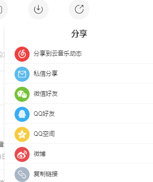

# 关于网易云音乐分享链接自带用户id的简述

## 1.起因

这个问题不知道从什么时候有的，可能从分享链接这个功能出来的时候就有了吧。注意到这个问题还是墙外的推友偶然间提醒了一句分享网易云链接的时候记得删除后面的“userid”。

## 2.复现

非常简单，只需要选择如图的分享链接就能得到我们需要的链接了。

~~（这里选择了我比较喜欢的《梦想彼方》作为例子）~~

链接：<http://music.163.com/song?id=32166159&userid=114514191>

可以看到最后有一个“userid”，这是分享者的用户id（这里为了隐私将id修改为无害的数字）

## 3.危害

通过这个id可以找到分享者是谁，只需要随便找一个人的主页然后将url里的数字id改成上述userid里的数字即可（搜索无效）。

对于某些高风险环境（比如说墙外论坛）或者高风险人群（键政人士、被恶俗狗盯上的人）可能会有隐私暴露的危险。众所周知，墙内应用要求非常多的个人信息而且天天被脱裤，所以说墙内上网和裸奔没什么区别。一旦泄露墙内账号就有被出道的风险，隐私防护工作功亏一篑。